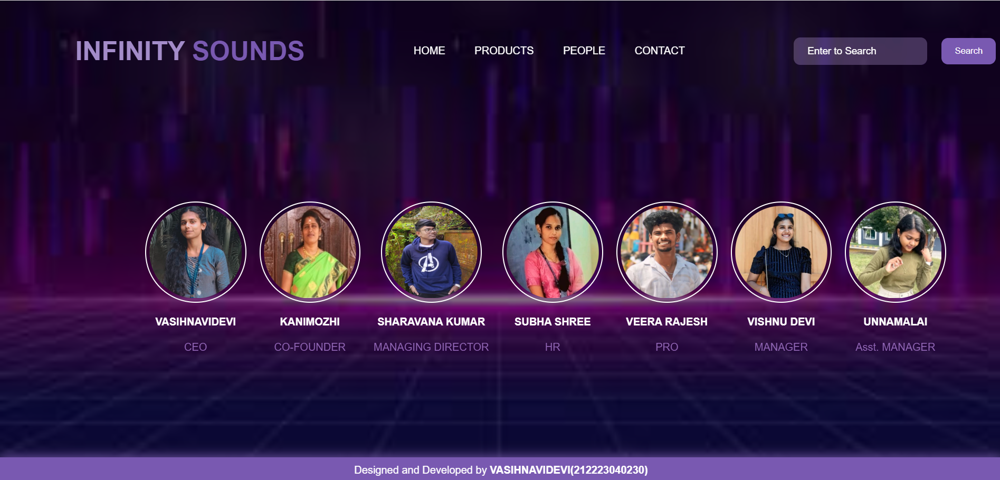
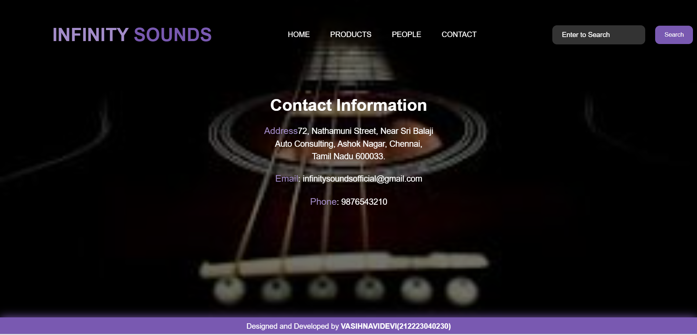

# Ex.07 Software Product Company Website
## Date:29/04/24

## AIM:
To develop a static company website to display the softwares and services provided by the company.

## DESIGN STEPS:

### Step 1:
Requirement collection.

### Step 2:
Creating the layout using HTML and CSS.

### Step 3:
Updating the sample content.

### Step 4:
Choose the appropriate style and color scheme.

### Step 5:
Validate the layout in various browsers.

### Step 6:
Validate the HTML code.

### Step 7:
Publish the website in the given URL.

## PROGRAM:
 DEVELOPED BY:VAISHNAVIDEVI V

 REFERNCE NUMBER:212223040230
## HOME PAGE:
```
home.html
<html>
  <head>
    <meta name="viewport" content="width=device-width, initial-scale=1.0" />
    <title>Music Instrument Company</title>
    <style type="text/css">
      * {
        margin: 0;
        padding: 0;
        font-family: Arial, Helvetica, sans-serif;
      }
      .banner {
        width: 100%;
        height: 95vh;
        background-image: linear-gradient(
            rgba(0, 0, 0, 0.60),
            rgba(0, 0, 0, 0.60)
          ),
          url(aa.jpeg);
        background-size: cover;
        background-position: center;
      }
      .navbar {
        width: 85%;
        margin: auto;
        padding: 35px 0;
        display: flex;
        align-items: center;
        justify-content: space-between;
      }
      .logo {
        color: #7959B1;
        font-size: 40px;
        font-weight: 700;
      }
      span {
        color: #A38CC9;
      }
      form {
        width: 200px;
        height: 40px;
        display: flex;
        background: rgba(255, 255, 255, 0.2);
        padding: 1px 1px;
        font-size: 15px;
        border-radius: 10px;
        backdrop-filter: blur(4px) saturate(180%);
      }
      form input {
        background: transparent;
        flex: 1;
        border: 0;
        outline: none;
        padding: 12px 20px;
        font-size: 15px;
        color: white;
      }
      ::placeholder {
        color: white;
      }
      form button {
        border: 0;
        outline: none;
        padding: 5px 20px;
        color: white;
        border-radius: 10px;
        background: #7959B1;
        cursor: pointer;
      }
      
      .navbar li {
        list-style: none;
        display: inline-block;
        margin: 0 20px;
        position: relative;
      }
      .navbar li a {
        text-decoration: none;
        color: white;
        text-transform: uppercase;
      }
      
      .content {
        position: absolute;
        top: 50%;
        left: 50%;
        transform: translate(-50%, -50%);
        text-align: center;
      }
      .text h3 {
        color: white;
        font-weight: 600;
        font-size: 50px;
        letter-spacing: 3px;
        font-family: 'Times New Roman';
      }
      
      
      footer {
        border: 1px;
        padding: 10px;

        transition: 0.5s;
        background: #7959B1;
        color: #ffffff;
        box-shadow: 0 0 20px #7959B1;
      }
    </style>
  </head>
  <body>
    <div class="banner">
      <br />
      <div class="navbar">
        <h1 class="logo"><span>INFINITY </span>SOUNDS</h1>
        <ul>
          <li><a href="home.html"> Home </a></li>
          <li><a href="product.html"> Products </a></li>
          <li><a href="people.html"> People </a></li>
          <li><a href="contact.html"> Contact </a></li>
        </ul>
        <form action="" method="get">
          <input type="text" placeholder="Enter to Search" />
          <button id="search" type="submit">Search</button>
        </form>
      </div>
      <div class="content">
        <div class="text">
          <h3>
            Discover the Symphony Within: Your Ultimate Musical Destination
          </h3>
          <br />

          <br />
        </div>
      </div>
    </div>
    <footer>
      <center>Designed and Developed by <b>VASIHNAVIDEVI V(212223040230)</b></center>
    </footer>
  </body>
</html>
```

## PRODUCT PAGE
```
product.html
<!DOCTYPE html>
<html>
<head>
    <meta name="viewport" content="width=device-width, initial-scale=1.0">
    <title>Product Page</title>
    <style type="text/css">
        * {
            margin: 0;
            padding: 0;
            font-family: Arial, Helvetica, sans-serif;
        }
        .banner {
            width: 100%;
            height: 95vh;
            background-image: linear-gradient(
                rgba(0, 0, 0, 0.35),
                rgba(0, 0, 0, 0.35)
            ),
            url(violet.jpg);
            background-size: cover;
            background-position: center;
        }
        .navbar {
            width: 85%;
            margin: auto;
            padding: 35px 0;
            display: flex;
            align-items: center;
            justify-content: space-between;
        }
        
        .logo {
            color: #7959B1;
            font-size: 40px;
            font-weight: 700;
        }
        span {
            color: #A38CC9;
        }
        form {
            width: 200px;
            height: 40px;
            display: flex;
            background: rgba(255, 255, 255, 0.2);
            padding: 1px 1px;
            font-size: 15px;
            border-radius: 10px;
            backdrop-filter: blur(4px) saturate(180%);
        }
        form input {
            background: transparent;
            flex: 1;
            border: 0;
            outline: none;
            padding: 12px 20px;
            font-size: 15px;
            color: white;
        }
        ::placeholder {
            color: white;
        }
        form button {
            border: 0;
            outline: none;
            padding: 5px 20px;
            color: white;
            border-radius: 10px;
            background: #7959B1;
            cursor: pointer;
        }
        
        .navbar li {
            list-style: none;
            display: inline-block;
            margin: 0 20px;
            position: relative;
        }
        .navbar li a {
            text-decoration: none;
            color: white;
            text-transform: uppercase;
        }
        .container {
            background: transparent;
            padding: 10px 5%;
            padding-bottom: 100px;
        }
        .container .box-container {
            display: grid;
            grid-template-columns: repeat(auto-fit, minmax(170px, 1fr));
            gap: 100px;
        }
        .container .box-container .box {
            color: white;
            box-shadow: 0 5px 10px rgba(0, 0, 0, 0.2);
            background: transparent;
            padding: 30px 20px;
            text-align: center;
        }
        .container .box-container .box img {
            height: 100px;
        }
        .container .box-container .box h3 {
            color: #ffffff;
            font-family: 'Times New Roman',;
            font-size: large;
            padding: 20px 0;
        }
        .container .box-container .box p {
            color: white;
            font-size: small;
            line-height: 1.5;
        }
        footer {
            border: 1px;
            padding: 10px;
            transition: 0.5s;
            background: #7959B1;
            color: #ffffff;
            box-shadow: 0 0 20px #7959B1;
        }
    </style>
</head>
<body>
<div class="banner">
    <br />
    <div class="navbar">
        <h1 class="logo"><span>INFINITY </span>SOUNDS</h1>
        <ul>
            <li><a href="home.html"> Home </a></li>
            <li><a href="products.html" class="bg-product"> Products </a></li>
            <li><a href="people.html"> People </a></li>
            <li><a href="contact.html"> Contact </a></li>
        </ul>
        <form action="" method="get">
            <input type="text" placeholder="Enter to Search" />
            <button type="submit">Search</button>
        </form>
    </div>
    <div class="container">
        <div class="box-container">
            <div class="box">
                
                <h3>TRUMPET</h3>
            </div>
            <div class="box">
                
                <h3>ACOUSTIC GUITAR</h3>
            </div>
            <div class="box">
                
                <h3>PIANO</h3>
            </div>
            <div class="box">
                
                <h3>FLUTE</h3>
            </div>
            <div class="box">
                
                <h3>VIOLIN</h3>
            </div>
            <div class="box">
                
                <h3>HARP</h3>
            </div>
            <div class="box">
                
                <h3>XYLOPHONE</h3>
            </div>
            <div class="box">
                
                <h3>DRUMS</h3>
            </div>
            <div class="box">
                
                <h3>DJ SET</h3>
            </div>
            <div class="box">
                
                <h3>VEENA</h3>
            </div>
        </div>
    </div>
</div>
<footer>
    <center>Designed and Developed by <b>VASIHNAVIDEVI(212223040230)</b></center>
</footer>
</body>
</html>
```

## PEOPLE PAGE:
```
people.html
html>
  <head>
    <meta name="viewport" content="width=device-width, initial-scale=1.0" />
    <title>People</title>
    <style type="text/css">
      * {
        margin: 0;
        padding: 0;
        font-family: Arial, Helvetica, sans-serif;
      }
      .banner {
        width: 100%;
        height: 95vh;
        background-image: linear-gradient(
            rgba(0, 0, 0, 0.50),
            rgba(0, 0, 0, 0.50)
          ),
          url(bc.jpg);
        background-size: cover;
        background-position: center;
      }
      .navbar {
        width: 85%;
        margin: auto;
        padding: 35px 0;
        display: flex;
        align-items: center;
        justify-content: space-between;
      }
      .logo {
          color: #7959B1;
          font-size: 40px;
          font-weight: 700;
      }
      span {
          color: #A38CC9;
      }
      form {
        width: 200px;
        height: 40px;
        display: flex;
        background: rgba(255, 255, 255, 0.2);
        padding: 1px 1px;
        font-size: 15px;
        border-radius: 10px;
        backdrop-filter: blur(4px) saturate(180%);
      }
      form input {
        background: transparent;
        flex: 1;
        border: 0;
        outline: none;
        padding: 12px 20px;
        font-size: 15px;
        color: white;
      }
      ::placeholder {
        color: white;
      }
      form button {
          border: 0;
          outline: none;
          padding: 5px 20px;
          color: white;
          border-radius: 10px;
          background: #7959B1;
          cursor: pointer;
        }
      .navbar li {
        list-style: none;
        display: inline-block;
        margin: 0 20px;
        position: relative;
      }
      .navbar li a {
        text-decoration: none;
        color: white;
        text-transform: uppercase;
      }
      .image {
        position: relative;
        border: 0;
        top: 150px;

        background: transparent;
      }
      .image table {
        border: 0;
        color: white;
        position: relative;
        left: 200px;
      }
      .image table img {
        height: 140px;
        width: 140px;
        border: 2px solid white;
        padding: 5px;
        border-radius: 50%;
      }
      .image table td {
        color: #9267B6;
      }
      footer {
          border: 1px;
          padding: 10px;
          transition: 0.5s;
          background: #7959B1;
          color: #ffffff;
          box-shadow: 0 0 20px #7959B1;
        }
    </style>
  </head>
  <body>
    <div class="banner">
      <br />
      <div class="navbar">
        <h1 class="logo"><span>INFINITY </span>SOUNDS</h1>
        <ul>
          <li><a href="home.html"> Home </a></li>
          <li><a href="products.html"> Products </a></li>
          <li><a href="people.html" class="bg-people"> People </a></li>
          <li><a href="contact.html"> Contact </a></li>
        </ul>
        <form action="" method="get">
          <input type="text" placeholder="Enter to Search" />
          <button type="submit">Search</button>
        </form>
      </div>
      <div class="image">
        <table cellspacing="20">
          <tr align="center">
            <td></td>
            <td></td>
            <td></td>
            <td></td>
            <td></td>
            <td></td>
            <td></td>
          </tr>
          <tr align="center">
            <th>VASIHNAVIDEVI </th>
            <th>KANIMOZHI</th>
            <th>SHARAVANA KUMAR </th>
            <th>SUBHA SHREE</th>
            <th>VEERA RAJESH</th>
            <th> VISHNU DEVI</th>
            <th> UNNAMALAI</th>
          </tr>
          <tr align="center">
            <td>CEO</td>
            <td>CO-FOUNDER</td>
            <td>MANAGING DIRECTOR</td>
            <td>HR</td>
            <td>PRO</td>
            <td>MANAGER</td>
            <td>Asst. MANAGER</td>
          </tr>
        </table>
      </div>
    </div>
    <footer>
      <center>Designed and Developed by <b>VASIHNAVIDEVI(212223040230)</b></center>
    </footer>
  </body>
</html>
```
## CONDUCT PAGE :
```
conduct.html
<!DOCTYPE html>
<html>
<head>
    <meta name="viewport" content="width=device-width, initial-scale=1.0">
    <title>Contact</title>
    <style type="text/css">
        * {
            margin: 0;
            padding: 0;
            font-family: Arial, Helvetica, sans-serif;
        }
        .banner {
            width: 100%;
            height: 95vh;
            background-image: linear-gradient(
                rgba(0, 0, 0, 0.55),
                rgba(0, 0, 0, 0.55)
            ),
            url(inst.jpg);
            background-size: cover;
            background-position: center;
        }
        .navbar {
            width: 85%;
            margin: auto;
            padding: 35px 0;
            display: flex;
            align-items: center;
            justify-content: space-between;
        }
        .logo {
            color: #7959B1;
            font-size: 40px;
            font-weight: 700;
        }
        span {
            color: #A38CC9;
        }
        .navbar form {
            width: 200px;
            height: 40px;
            display: flex;
            background: rgba(255, 255, 255, 0.2);
            padding: 1px 1px;
            font-size: 15px;
            border-radius: 10px;
            backdrop-filter: blur(4px) saturate(180%);
        }
        .navbar form input {
            background: transparent;
            flex: 1;
            border: 0;
            outline: none;
            padding: 12px 20px;
            font-size: 15px;
            color: white;
        }
        ::placeholder {
            color: white;
        }
        .navbar form button {
            border: 0;
            outline: none;
            padding: 5px 20px;
            color: white;
            border-radius: 10px;
            background: #7959B1;
            cursor: pointer;
        }
        .navbar li {
            list-style: none;
            display: inline-block;
            margin: 0 20px;
            position: relative;
        }
        .navbar li a {
            text-decoration: none;
            color: white;
            text-transform: uppercase;
        }
        .box {
            display: flex;
            column-gap: 40px;
            background: transparent;
            justify-content: center;
            position: relative;
            top: 50px;
        }
        .box-2 {
            background: rgba(255, 255, 255, 0.2);
            height: 400px;
            width: 400px;
            border-radius: 20px;
            background: transparent;
            position: relative;
        }
        .box-2 h2 {
            color: white;
            text-align: center;
            font-size: 36px;
            margin-top: 25px;
        }
        .box-2 p {
            color: white;
            text-align: center;
            font-size: 18px;
            margin-top: 20px;
            line-height: 1.5;
        }
        .box-2 span {
            color: #A38CC9;
            font-size: 20px;
        }
        footer {
            border: 1px;
            padding: 10px;
            transition: 0.5s;
            background: #7959B1;
            color: #ffffff;
            box-shadow: 0 0 20px #7959B1;
        }
    </style>
</head>
<body>
<div class="banner">
    <br />
    <div class="navbar">
        <h1 class="logo"><span>INFINITY </span>SOUNDS</h1>
        <ul>
            <li><a href="home.html"> Home </a></li>
            <li><a href="products.html"> Products </a></li>
            <li><a href="people.html"> People </a></li>
            <li><a href="contact.html" class="bg-contact"> Contact </a></li>
        </ul>
        <form action="" method="get">
            <input type="text" placeholder="Enter to Search" />
            <button type="submit">Search</button>
        </form>
    </div>
    <div class="box">
        <div class="box-2">
            <h2>Contact Information</h2>
            <p>
                <span>Address</span>72, Nathamuni Street, Near Sri Balaji Auto Consulting, Ashok Nagar, Chennai,<br> 
                Tamil Nadu 600033.</br>
            </p>
            <p><span>Email</span>: infinitysoundsofficial@gmail.com</p>
            <p><span>Phone</span>: 9876543210</p>
        </div>
    </div>
</div>
<footer>
    <center>Designed and Developed by <b>VASIHNAVIDEVI(212223040230)</b></center>
</footer>
</body>
</html>
```
## OUTPUT:
## FRONT PAGE:
.png>)
## PRODUCT PAGE:
.png>)
## PEOPLE PAGE:

## CONDUCT PAGE:

## RESULT:
The program for designing software company website using HTML and CSS is completed successfully.
